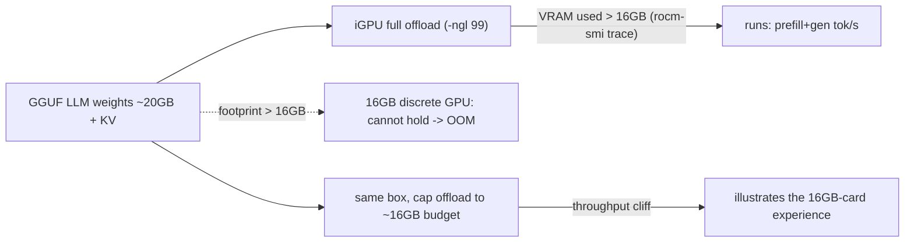

# Demo H — a >16GB LLM on the Strix Halo iGPU (unified-memory flagship)

> The **visceral, only-on-APU** counterpart to the synthetic `segment_po2`
> mem-wall demo: a genuinely large instruct LLM — the RAG/agent **generator** —
> running fully offloaded on the **Radeon 8060S iGPU** (`gfx1151`) via
> **llama.cpp built with HIP**, which a 16GB discrete GPU literally cannot hold.
>
> Measured on **AMD Ryzen AI MAX+ PRO 395 / Radeon 8060S, ROCm 7.2.3** — 94GB
> unified LPDDR5X, **32GB iGPU VRAM carveout**.

## The credibility crux — how we honestly prove ">16GB, a 16GB discrete card OOMs"

Three honest pillars (no fabricated discrete-GPU number):

1. **Empirical** — we sample `rocm-smi --showmeminfo vram` *during* the full
   offload run and report **peak used VRAM > 16GB**. The iGPU really is holding
   the whole model + KV cache in its VRAM carveout.
2. **Footprint** — the model file + loaded size is **> 16GB**. A 16GB discrete
   card cannot fully offload it; it must spill or OOM.
3. **Contrast** — on the *same box* we cap GPU offload to a ~16GB budget
   (partial `-ngl`) and show the **throughput cliff**, plus a CPU baseline
   (`-ngl 0`).



## Honesty caveats (stated everywhere)

- This **accelerates / enables the AI MODEL** (the RAG generator), **NOT the
  proof**. The RISC0 STARK stays CPU-only on AMD — that line is unchanged.
- The iGPU VRAM is a **32GB carveout** of the 94GB unified pool. The model does
  **not** use all 94GB; the 94GB is what makes such a large carveout (and GTT
  extension) *possible* vs a fixed 16GB discrete board.
- The 16GB-cap contrast on this box is **generous to the discrete card**: here
  the CPU spillover is the *same LPDDR5X*, so there is no PCIe penalty. A real
  16GB discrete GPU is **worse** — it spills over PCIe or hard-OOMs.
- **Real pretrained weights** (Qwen2.5-32B-Instruct), not random-init — the
  sample generation in `artefacts/bigmodel.log` is genuine model output.

## Model

Default: **Qwen2.5-32B-Instruct, `Q4_K_M`** (`bartowski/Qwen2.5-32B-Instruct-GGUF`).
- On disk: **~19.85GB**. Loaded footprint (weights + a few-k KV): **~20.5GB** —
  cleanly `> 16GB` and `<= ~28GB`, so it fits the 32GB carveout with headroom.
- The `.gguf` is **gitignored** (never committed). Only `artefacts/` is.

## Run

```bash
make demo-bigmodel          # setup llama.cpp(HIP) + fetch GGUF + run + plot (Halo; heavy, network)
make demo-bigmodel-replay   # show the committed artefacts (no GPU/model)
```

or step by step:

```bash
bash scripts/setup-llamacpp.sh   # build llama.cpp -DGGML_HIP=ON -DAMDGPU_TARGETS=gfx1151 (one-time)
bash scripts/fetch-model.sh      # download the GGUF (one-time, ~20GB, gitignored)
bash scripts/run-bigmodel.sh     # iGPU full offload + VRAM trace + 16GB cap + CPU baseline
```

Knobs (env): `NGL_FULL` (default 99), `NGL_CAP` (~16GB budget, default 46),
`PROMPT_TOKS` (4096), `GEN_TOKS` (256), `REPS` (3), `CTX` (8192),
`MODEL_REPO` / `MODEL_FILE`.

## Layout

```
amd-bigmodel-demo/
├── scripts/
│   ├── setup-llamacpp.sh   # build llama.cpp with the ROCm/HIP backend (gfx1151)
│   ├── fetch-model.sh      # download one real >16GB-footprint GGUF (gitignored)
│   ├── run-bigmodel.sh     # the crux: full iGPU offload + VRAM>16GB trace + 16GB cap + CPU
│   └── plot-bigmodel.py    # 2-panel VRAM(+16GB line) / throughput chart, markdown fallback
├── artefacts/              # bigmodel.{csv,json,log,png} — committed evidence (NOT the model)
├── build/                  # llama.cpp checkout + HIP build (gitignored)
├── models/                 # the *.gguf (gitignored)
├── MODELS.manifest.txt     # source repo + bytes + sha256 of every weight used
├── .gitignore
└── README.md
```

See [`../../docs/amd-strix-halo-advantage.md`](https://github.com/iiyyll01lin/zkp-final/blob/main/docs/amd-strix-halo-advantage.md)
(robust-win #2) and [`../../docs/amd-strix-halo-acceleration.md`](https://github.com/iiyyll01lin/zkp-final/blob/main/docs/amd-strix-halo-acceleration.md)
for where this sits in the report, and `lab/14_unified_memory_bigmodel.ipynb`
for the live/replay walk-through.
