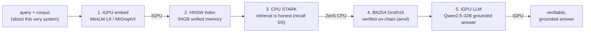

# verifiable-rag-e2e — Verifiable RAG on Strix Halo, end-to-end across every engine

One real query flows through **all five engines** of the AMD Ryzen AI MAX+ 395
(Strix Halo) box and comes out as a **verifiable, grounded answer**. This PoC is
pure **orchestration + narration** — it does not reimplement embedding / STARK /
on-chain / LLM, it threads the *same* query and corpus through the already-existing
per-engine demos and records what each engine did.



## Stage → engine → home demo → committed artefact

| # | stage | engine | home demo | committed artefact |
|---|-------|--------|-----------|--------------------|
| 1 | embed | **iGPU** (MiniLM-L6, MIGraphX/ROCm) | `poc/zkml-faithful-demo/zkrag/scripts/build_index.py --semantic` | `…/zkrag/artefacts/zkrag.corpus.json` |
| 2 | index | unified LPDDR5X (CPU host build) | zkRAG host `build_graph` | `…/zkrag/artefacts/zkrag.index.json` |
| 3 | STARK | **CPU** (RISC0 r0vm) | `poc/zkml-faithful-demo/zkrag/scripts/run-all.sh` | `…/zkrag/artefacts/zkrag.journal.json` + `zkrag.proof.info` |
| 4 | on-chain | EVM / anvil (CPU Groth16 prover) | `poc/folding-step-demo/scripts/run-zkrag-bn254-onchain.sh` | `…/folding-step-demo/artefacts/zkrag-bn254/proof.json` |
| 5 | LLM gen | **iGPU** (Qwen2.5-32B, llama.cpp/HIP) | `poc/amd-bigmodel-demo` | **NEW** `artefacts/e2e-answer.md` |

## Honesty rule (exact per-stage attribution)

- The **iGPU** does stages **1 and 5** — the AI model (embed + generate).
- The **CPU** does stage **3** — the RISC0 STARK proof. The proof is **CPU-only**;
  the iGPU never proves.
- Stage **4** verifies the retrieval proof **on-chain** (BN254 Groth16 on anvil).
- **"Verifiable RAG"** = the *retrieval* is proven honest (STARK + on-chain) and the
  answer is **grounded** in the proven-correct retrieved docs. The **LLM output
  itself is NOT proven** — treat it as a grounded generation, not a verified claim.
- The bigmodel VRAM+GTT and contention caveats from `poc/amd-bigmodel-demo` carry
  over (the >16GB model is GPU-resident only thanks to the 94GB unified pool; the
  16GB-cap contrast is generous to a discrete card).

## Run it

```bash
# Gate each heavy stage by its precondition; replay from committed artefacts what
# cannot run live on this box (no ROCm / r0vm / anvil / model, or a contended iGPU):
bash scripts/run-e2e.sh

# Replay every stage from committed artefacts (laptop-safe; no GPU/Docker/anvil/model):
E2E_FORCE_REPLAY=1 bash scripts/run-e2e.sh

# Opt into the live heavy stages on a quiet Strix Halo:
E2E_LIVE_EMBED=1 E2E_LIVE_STARK=1 E2E_LIVE_ONCHAIN=1 bash scripts/run-e2e.sh
```

Stage 5 generates a real answer with the real Qwen2.5-32B weights. On a free iGPU
it offloads fully (`-ngl 99`); set `E2E_CPU_GEN=1` to generate on the CPU when the
iGPU is contended (the timeline + answer label which engine actually ran). With
`E2E_FORCE_REPLAY=1` the committed `e2e-answer.md` is reused unchanged.

## Committed artefacts (small; the source of truth for the lab/docs)

- `artefacts/e2e-timeline.json` — per-stage `engine` / `status` (live|replay) /
  `metric` / `artefact` / `seconds` + the shared query, host, and honesty note.
- `artefacts/e2e-answer.md` — the query, the retrieved doc texts, and the grounded
  LLM answer.

The heavy receipts (RISC0 STARK seal, Groth16 verifier, GGUF model) stay in their
home demos and are gitignored there. `lab/16_verifiable_rag_e2e.ipynb` narrates this
pipeline and `lab/labkit.py` exposes `load_e2e_timeline()` + `plot_e2e_pipeline()`.
Makefile shortcuts: `make demo-e2e` (gated run) and `make demo-e2e-replay`.
