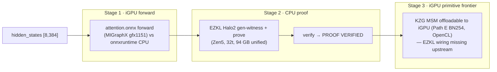

# zkLLM AMD engine-split demo — one attention block across three engines

> Takes the **same** MiniLM scaled-dot-product self-attention head **with softmax** that
> `poc/zkml-faithful-demo` proves through EZKL Halo2, and walks it across the three AMD Strix Halo
> engines **end-to-end and measured**, each with an honest *"what this engine can and cannot
> accelerate"* verdict. It is the synthesis of **Path F** (iGPU AI inference), **Demo G / G4**
> (faithful zkLLM EZKL proof) and **Path E** (SNARK primitives on the iGPU) into one zkLLM teaching
> story for Strix Halo.

All proving here is **CPU-only on the AMD Strix Halo** (Ryzen AI MAX+ 395, 94 GB, kernel 6.17). The
iGPU accelerates the model **forward** only; EZKL Halo2 proving is CPU-only — consistent with the
rest of the repo's honesty rule.

---

## The pipeline (one MiniLM attention head, three engines)



The proven unit is the committed `poc/zkml-faithful-demo/zkllm/artefacts/attention.onnx` (input
`hidden_states` `[8,384]` = `seq=8, d_model=384`; output `attn_out` `[8,32]` = `d_head=32`; opset 17;
softmax inside). The numbers at `batch=1, seq=8` correspond to the exact circuit the Halo2 proof
attests.

---

## What is measured on this box (2026-06-11, AMD Strix Halo)

### Stage 1 — iGPU forward vs CPU (the AI MODEL) — **measured live here**

The forward bench re-exports a dynamic-axis copy of the proven head and sweeps a small `batch×seq`
grid through MIGraphX (iGPU, `gfx1151`) and onnxruntime (CPU, 32 threads), best-of-N timing.

| workload | CPU (onnxruntime) | iGPU (MIGraphX) | speedup (CPU/iGPU) |
|---|---|---|---|
| **`b1·s8` (the proven point)** | **0.012 ms** | **0.129 ms** | **0.09× → CPU wins** |
| `b1·s512` (best iGPU point) | 0.220 ms | 0.179 ms | 1.23× |
| `b32·s32` | 0.193 ms | 0.160 ms | 1.21× |

**Honest verdict.** A *single* attention sub-block is **dispatch-bound**: at the proven `seq=8`
scale the CPU wins because the ~0.13 ms iGPU kernel-launch floor dwarfs a few microseconds of
compute. The iGPU only reaches parity/slight win (≈1.0–1.25×) once `batch×seq` grows. **iGPU forward
acceleration is real but size-gated** — the clean **~1.9–10.6× iGPU win is the *full* MiniLM** model
(Path F, `poc/amd-ai-inference-demo`), not one head. (Full grid in `artefacts/attention-forward.csv`;
this PoC does not over-claim a single-block iGPU win.)

> The Path F range above is **derived at synth time** from
> `poc/amd-ai-inference-demo/artefacts/ai-inference.csv` (clean-solo rows only — see
> `read_path_f_range` in `src/02_synthesize.py`), never hard-coded, so it cannot drift
> from the artefact. The retired **8.83–25.20×** range (spelled `9–25×` or `8–25×`) was
> measured with **no solo gate**; commit `4f8b139` (2026-06-18) recalibrated it.

### Stage 2 — CPU EZKL Halo2 proof — **delegated** to `poc/zkml-faithful-demo`

The proof half is **delegated, not re-implemented** (`scripts/run-all.sh prove` runs the faithful
zkLLM pipeline; the committed `prove.info` is the replay source of truth).

| metric | value |
|--------|-------|
| circuit size | logrows = 16 |
| witness | 0.274 s |
| **prove** | **7.852 s** |
| **verify** | `PROOF VERIFIED` (exit 0) |
| proof size | 545,679 bytes (~533 KB) |

**Honest verdict.** EZKL Halo2 proving is **CPU-only on AMD** — the iGPU/NPU never touch the proof.
The Strix Halo win is **32 threads + 94 GB unified memory** holding the CPU-side prover working set at scale.

### Stage 3 — the iGPU MSM frontier — **reused** from Path E

The KZG-commitment **MSM** that dominates Halo2 proving runs on this iGPU via OpenCL on the **BN254
G1** curve EZKL/Halo2 proves over (Path E, `poc/amd-gpu-zk-primitive-demo/artefacts/gpu-bn254.csv`):

| log2(size) | iGPU OpenCL | CPU (32t arkworks) | speedup |
|---|---|---|---|
| 16 | 39.255 ms | 25.681 ms | 0.654× |
| 18 | 123.316 ms | 100.361 ms | 0.814× |
| 20 | 452.990 ms | 383.001 ms | 0.845× |
| 22 | 1518.493 ms | 1656.943 ms | **1.091×** |

> **Retracted numbers.** An earlier revision of this table read `1.15× / 1.35× / 0.99× / 1.11×`
> (summarised as "1.1–1.35×"). Those were **contention-inflated**: AI inference running alongside the
> benchmark stole CPU from the arkworks baseline and slowed it down, flattering the GPU ratio. They
> were withdrawn by the clean-solo re-measurement above and by upstream
> [`reading-notes/path-e-amd-gpu-zk-primitives.md`](https://github.com/iiyyll01lin/zkp-final/blob/main/reading-notes/path-e-amd-gpu-zk-primitives.md) §4b. Do not quote them.

**Honest verdict.** The capability is demonstrated — the MSM *runs* on the iGPU and the proof
verifies — but at these sizes running it there is **slower than the CPU, not faster**: the clean-solo
BN254 G1 MSM is **below parity until ~2²²** (0.654× / 0.814× / 0.845× at 2¹⁶/2¹⁸/2²⁰) and only
crosses at **2²² (1.091×)**. So Stage 3 is an **offloadability** result, not a speed result. The
size-gating is a property of **that ec-gpu OpenCL kernel**, not of MSM as such and not of the shared
memory: on the same chip, same memory, same contention, swapping in a native HIP kernel is
**2.0–2.2× faster and already ahead at 2¹⁶**
(`poc/amd-gpu-zk-primitive-demo/artefacts/msm-ntt-backend-gfx1151.csv`). On top of that, EZKL
upstream wires GPU acceleration **only through CUDA (icicle) / Apple Metal** — there is no
OpenCL/ROCm/Vulkan device path in EZKL's prover. So this is a **documented frontier**
(`EZKL-GPU-BLOCKED-ON-AMD`, see upstream
[`ezkl-gpu.md`](https://github.com/iiyyll01lin/zkp-final/blob/main/poc/amd-gpu-zk-primitive-demo/artefacts/ezkl-gpu.md)),
**not** a claim of GPU-accelerated proving.

> **The takeaway.** No single engine "does it all": the iGPU is a dense-GEMM engine (great for the
> *full* model, wasted on one tiny sub-block), the CPU + 94 GB unified memory is the proving
> workhorse, and the iGPU's OpenCL MSM is *offloadable* for KZG but — on that kernel — only reaches
> parity at ~2²², and isn't reachable from EZKL anyway. The win/loss at every stage is a
> **software-wiring** story, not a silicon one: the same silicon runs the same MSM 2.0–2.2× faster
> through a native HIP kernel.

---

## Three-engine zkLLM panorama (NPU + CPU + iGPU, one capability map)

The split above proves *one head* through *one* engine pair. This panorama goes wider: it pulls the
**already-measured, already-committed** best contribution of **all three** Strix Halo engines into a
single honest picture, anchored on one representative workload — **MiniLM `d_model=384`, `T=256`**
(the exact shape the NPU `mha_qkv_proj_d384_t256` row and the `ai-inference` `b1·s256` rows measure).

It is a **capability map**, *not* one monolithic proof flowing through all three engines.
`src/05_three_engine.py` reads the four committed sources (NPU dispatch JSON, the Path F
`ai-inference.csv`, this PoC's `scale-sweep.csv`, and Path E's `zkllm-msm.csv`) and emits
`artefacts/three-engine.json` + `artefacts/three-engine.png` (`bash scripts/run-all.sh
three-engine` — stdlib-only synth, no GPU, no Docker, no engine re-run).

*Three-engine zkLLM panorama* — chart: `artefacts/three-engine.png` (rendered by the
command above; the image file itself is not carried in this trimmed repo).

| stage | engine | proof system / precision | measured contribution (d384·T256 anchor) | honesty |
|---|---|---|---|---|
| **1 · model forward** | XDNA2 **NPU** int8 GEMM | int8 GEMM (compute-only) | **608.9 GFLOPs** @ 124 µs (`mha_qkv_proj_d384_t256`); iGPU/CPU fp32 full forward = **3.95×** (`b1·s256`, clean solo) | forward only, never the proof; int8 GEMM ≠ fp32 latency; harness at **~1–3 %** of the advertised XDNA2 int8 ceiling; iGPU forward win is **size-gated** |
| **2 · prove (SHIPPING)** | Zen5 **CPU** + 94 GB unified | **EZKL Halo2 / KZG over BN254** | **110.5 s** @ **82 GB** (12-head MHA, logrows 21); single head 15.4 s @ 2.9 GB | the *only* proof that ships; **CPU-only on AMD** (win = 32 threads + 94 GB); the full transformer **layer caps** at the 94 GB ceiling |
| **3 · proof MSM offload** | RDNA **iGPU** OpenCL | **bellperson Groth16 / BLS12-381** (re-cast, **multi-head**) | **1.12× → 1.44×** prove speedup; the **12-head MiniLM** family climbs **1.12× (2²²) → 1.36× (2²³) → 1.41× (2²⁴, m≈15.5M)**; iGPU **FFT/NTT** proxy **1.94× → 6.95×** *outpaces* the iGPU **MSM** proxy **0.73× → 1.42×** | a **RE-CAST**, not EZKL — different prover *and* curve; softmax excluded (lookup job); **size-gated** + host-contention sensitive; **NTT > MSM** is where the iGPU helps the proof most; EZKL cannot dispatch to the iGPU (`EZKL-GPU-BLOCKED-ON-AMD`) |

> ✅ **Resolved — was: "stale artefact".** The committed `three-engine.json` / `.md` used to carry
> the retired **`15.64×`** for the stage-1 `b1·s256` forward. `src/05_three_engine.py` already
> derived that field from `ai-inference.csv`, so the generator was never wrong; the stale value was
> purely a replay-age problem — the committed panorama predated the `c84e772` clean-solo restore of
> `ai-inference.csv`. `make showcase` has since regenerated all three artefacts: both files now read
> the **canon 3.954×** (`cpu 6.932 ms / rocm 1.753 ms`), matching the table above, and `15.64`
> appears in neither. Kept as a note because the failure mode outlives this instance: **correcting a
> generator does not correct what is already committed**, so a replayed artefact is only ever as
> fresh as its last regeneration.

### Honesty boundary (read before quoting the panorama)

- It is a **capability map of measured best contributions**, **not** one proof flowing end-to-end
  through NPU → CPU → iGPU.
- **Stage 2 is the shipping proof**: EZKL **Halo2 / KZG over BN254** on the **CPU**.
- **Stage 3 is a re-cast**: a separate **bellperson Groth16 over BLS12-381** of the attention
  **matmuls** (softmax excluded) — a *different prover and a different curve* from Stage 2. EZKL
  itself **cannot** dispatch to this iGPU (it wires only CUDA/icicle + Apple Metal), so this is the
  only way the iGPU touches *any* proof.
- **Cross-precision / cross-scale**: NPU **int8** GEMM (compute-only) vs iGPU **fp32** full forward
  vs CPU — the NPU number is *not* directly comparable to the fp32 latencies.
- The NPU sits at **~1–3 %** of its advertised int8 ceiling under the generic `whole_array` harness
  (no bespoke MLIR kernel).
- **Both** the iGPU *forward* win and the iGPU *proof* win are **size-gated** (they lose small).
- The repo honesty rule is intact: the **iGPU/NPU accelerate the model forward**; the **only**
  iGPU-on-proof is the **re-cast OpenCL MSM** (Stage 3), **never** EZKL Halo2.

---

## Layout

```
poc/zkllm-amd-split-demo/
├── README.md                       # this file
├── INTEGRATION-SPEC.md             # labkit / Makefile / notebook wiring
├── requirements.txt, .gitignore
├── scripts/
│   ├── run-all.sh                  # all | forward | prove | parity | synth | plot | replay | three-engine
│   ├── scale-sweep.sh              # (A) EZKL prove + fwd per growing unit → scale-sweep.csv (heavy, opt-in)
│   ├── plot-split.py               # → artefacts/split.png (degrades to split.md)
│   └── plot-three-engine.py        # → artefacts/three-engine.png (degrades to three-engine.md)
├── src/
│   ├── 01_attention_forward_bench.py   # iGPU(MIGraphX) vs CPU(onnxruntime) forward sweep
│   ├── 02_synthesize.py                # forward CSV + prove.info + Path E BN254 + parity → split.json
│   ├── 03_build_scaled_unit.py         # (A) parametric ONNX builder: head→mha→layer→stacked
│   ├── 04_parity.py                    # (B) iGPU/CPU fwd vs proven Halo2 output → parity.json
│   ├── 05_three_engine.py              # NPU JSON + ai-inference CSV + scale-sweep + zkllm-msm → three-engine.json
│   ├── _ezkl_flow.py                   # (A) parametric EZKL Halo2 flow (reuses Demo-G logic)
│   └── _forward_once.py                # (A) iGPU-vs-CPU forward timer for one scaled unit
└── artefacts/                      # committed source of truth for replay
    ├── attention-forward.csv       # Stage 1 sweep (measured live on this box)
    ├── attention-forward.log
    ├── scale-sweep.csv             # (A) scale curve: logrows/prove_s/peak_rss/fwd_ms + the cap
    ├── parity.json                 # (B) iGPU/CPU == proven Halo2 output (within quant tolerance)
    ├── split.json                  # the 3-engine timeline + honest verdict (+ parity block)
    ├── split.png                   # the one teaching figure
    ├── split.md                    # markdown fallback of the figure
    ├── three-engine.json           # the NPU+CPU+iGPU panorama (capability map) from the four sources
    ├── three-engine.png            # the panorama figure
    └── three-engine.md             # markdown fallback of the panorama figure
```

Committed artefacts are the source of truth (live-or-replay). The dynamic-axis
`attention.dyn.onnx` is **regenerable** (re-exported from the committed, proven `attention.onnx`) and
gitignored; the heavy `pk.key`/`*.srs` belong to the delegated `poc/zkml-faithful-demo` and are not
duplicated here.

---

## Run it

```bash
cd poc/zkllm-amd-split-demo

# Everything: live iGPU-vs-CPU forward → delegated EZKL prove → synth → plot
./scripts/run-all.sh all

# Individual stages:
./scripts/run-all.sh forward     # Stage 1 forward sweep (needs ROCm/MIGraphX for the iGPU row)
./scripts/run-all.sh prove       # Stage 2 EZKL proof (delegated to zkml-faithful-demo; Docker)
./scripts/run-all.sh parity      # (B) iGPU/CPU forward output vs proven Halo2 output → parity.json
./scripts/run-all.sh synth       # merge → artefacts/split.json
./scripts/run-all.sh plot        # → artefacts/split.png

# Fast, GPU-free, Docker-free reproduction from committed artefacts (any laptop):
./scripts/run-all.sh replay      # synth + plot only → reproduces split.json / split.png

# Three-engine panorama (NPU + CPU + iGPU capability map) from committed sources:
./scripts/run-all.sh three-engine  # → three-engine.json + three-engine.png (no GPU/Docker/re-run)

# (A) Heavy, opt-in: scale the proven unit up its EZKL prover curve to the cap.
#     Works in a gitignored scratch dir, never touches the committed Demo-G
#     artefacts; emits artefacts/scale-sweep.csv. Needs the EZKL venv (see below).
ZKLLM_SCALE_CONFIGS="head mha layer layerx2" ./scripts/scale-sweep.sh
```

- **`forward`/`all`** need torch + onnx + onnxruntime (a self-contained `.venv` is built on first
  run, or an existing sibling venv with the same stack is reused) and — for the iGPU row — ROCm's
  MIGraphX python bindings under `/opt/rocm-*/lib`.
- **`synth`** uses only the Python stdlib; **`plot`/`replay`** need matplotlib (else they emit
  `split.md`). So **`replay` runs on a CPU-only laptop** with no GPU, no Docker, no torch.

### Was the iGPU row captured live?

The committed `attention-forward.csv` was **measured live on the AMD Strix Halo** (gfx1151) on
2026-06-11; `split.json.captured.forward == "live"`. On a host without ROCm/MIGraphX, `run-all.sh
forward` still records the CPU baseline and leaves the iGPU row uncaptured (the synthesizer marks it
explicitly); `replay` then reproduces this committed split from whatever is on disk.

---

## Honesty boundary (read before quoting any number)

- iGPU accelerates the **model forward**, never the proof — and for a *single* attention sub-block at
  `seq=8` it is dispatch-bound, so the **CPU wins**; the iGPU forward win is **size-gated** (the
  full MiniLM, Path F).
- EZKL **Halo2 proving is CPU-only on AMD**; the win is 32 threads + 94 GB unified memory removing
  OOM.
- The KZG MSM **could** run on the iGPU (Path E, OpenCL, BN254) — but that is *offloadability*, not
  speed: the clean-solo BN254 G1 MSM measures **0.654× / 0.814× / 0.845× at 2¹⁶/2¹⁸/2²⁰ and 1.091× at
  2²²**, i.e. **below parity until ~2²²**. (The older **1.1–1.35×** figure was **contention-inflated**
  — a concurrent AI-inference load slowed the arkworks CPU baseline — and is **retired**; see upstream
  [`reading-notes/path-e-amd-gpu-zk-primitives.md`](https://github.com/iiyyll01lin/zkp-final/blob/main/reading-notes/path-e-amd-gpu-zk-primitives.md) §4b.)
  The size-gating is a property of **that ec-gpu OpenCL kernel**, not of MSM or of shared memory:
  a native HIP kernel on the same chip is **2.0–2.2× faster and wins from 2¹⁶**.
  And EZKL wires only CUDA/Metal → documented frontier (upstream
  [`ezkl-gpu.md`](https://github.com/iiyyll01lin/zkp-final/blob/main/poc/amd-gpu-zk-primitive-demo/artefacts/ezkl-gpu.md));
  this PoC does **not** claim GPU-accelerated proving.
- Weights are **seeded**; swapping trained HF tensors is a one-liner that does not change the
  circuit (carried over from `poc/zkml-faithful-demo`).

---

## References / neighbours

- Proven unit + EZKL proof (Demo G / G4): [`poc/zkml-faithful-demo/`](../zkml-faithful-demo/)
- iGPU forward win on the *full* model (Path F): [`poc/amd-ai-inference-demo/`](../amd-ai-inference-demo/)
- iGPU SNARK primitives incl. BN254 MSM + the EZKL-on-AMD blocker (Path E):
  [`poc/amd-gpu-zk-primitive-demo/`](../amd-gpu-zk-primitive-demo/)
- Lab notebook: `lab/10_zkllm_amd_split.ipynb`

<!-- demo-zkllm-split-status: PASS forward_proven_cpu_ms=0.012 forward_proven_igpu_ms=0.129 forward_proven_speedup=0.09 forward_best_igpu_speedup=1.23 forward_captured=live prove_s=7.852 proof_bytes=545679 verify="PROOF VERIFIED" msm_bn254_speedup="0.654-1.091x(clean-solo;below-parity-until-~2^22;old-1.1-1.35x-was-contention-inflated-and-is-retired)" msm_blocker=EZKL-GPU-BLOCKED-ON-AMD proving=CPU-only -->
